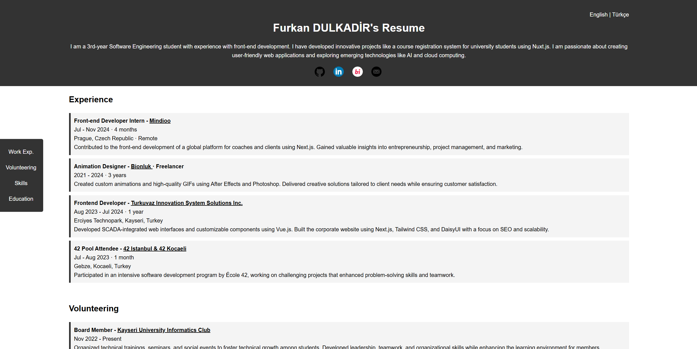
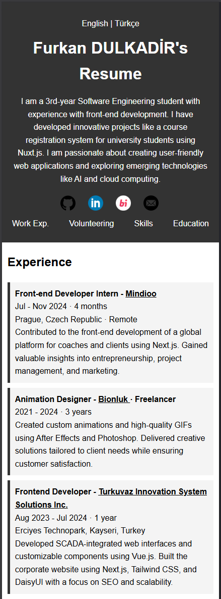

# Portfolio of Furkan Dulkadir

This project is a personal website showcasing Furkan Dulkadir's portfolio and resume. The site provides information about Furkan's educational background, work experiences, and skills.

## Contents

- [General Information](#general-information)
- [Technologies Used](#technologies-used)
- [Installation and Running](#installation-and-running)
- [Contact](#contact)

| Desktop Preview | Mobile Preview |
|------|-------|
|||

## General Information

This project is a static website created using HTML and CSS. It showcases Furkan DULKADİR's education and work experiences, social media links, and skills.

## Technologies Used

- HTML5
- CSS3

## Installation and Running

To run the project on your local machine, follow these steps:

1. Clone this repository:
   `git clone https://github.com/furkandlkdr/portfolio-html.git`

2. Navigate to the project directory:
   `cd portfolio`

3. Run the project using a web server. For example, with the VS Code Live Server extension:
   - Install the 'Live Server' extension in VS Code.
   - Open the 'index.html' file.
   - Right-click and select 'Open with Live Server'.

4. View the project in your browser. It will usually be at `http://127.0.0.1:5500/`.

## Contact

You can reach Furkan DULKADİR on the following platforms:

- [GitHub](https://github.com/furkandlkdr)
- [LinkedIn](https://linkedin.com/in/furkandlkdr)
